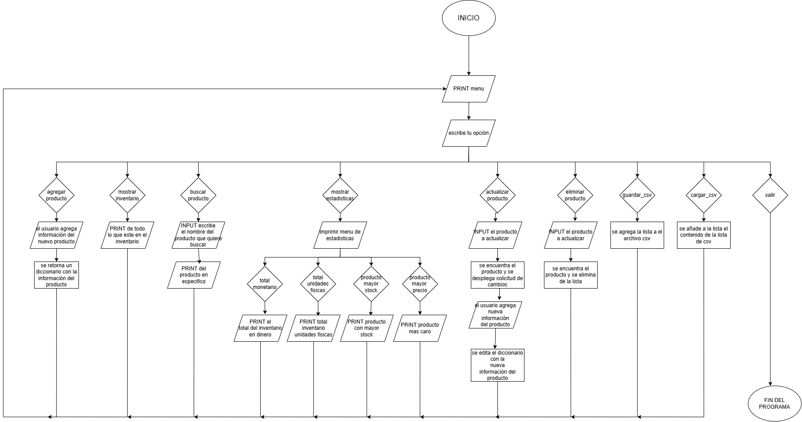

# Sistema de Gestión de Inventario

Sistema de gestión de inventario por consola desarrollado en Python, que permite registrar, consultar, actualizar y eliminar productos, con soporte para persistencia de datos mediante archivos CSV.

---

## Estructura del Proyecto

```
proyecto/
├── main.py          # Punto de entrada y bucle principal del programa
├── servicios.py     # Funciones del sistema (lógica de negocio)
└── data/
    └── data.csv     # Archivo de datos generado automáticamente al guardar
```

---

## Requisitos

- Python 3.x
- No requiere librerías externas (solo módulos estándar: `csv`, `os`)

---

## Cómo ejecutar

```bash
python main.py
```

---

## Funcionalidades

El sistema presenta un menú principal con las siguientes opciones:

1. **Agregar producto** – Registra un nuevo producto con nombre, precio y cantidad.
2. **Mostrar inventario** – Lista todos los productos registrados.
3. **Calcular estadísticas** – Muestra análisis del inventario (ver detalle abajo).
4. **Buscar** – Busca un producto por nombre.
5. **Actualizar** – Modifica el precio y la cantidad de un producto existente.
6. **Eliminar** – Elimina un producto del inventario.
7. **Guardar CSV** – Exporta el inventario al archivo `data/data.csv`.
8. **Cargar CSV** – Importa el inventario desde `data/data.csv`.
9. **Salir** – Cierra el programa.

### Panel de Estadísticas (Opción 3)

- **Total Inventario** – Calcula el valor monetario total del inventario (`precio × cantidad` por cada producto).
- **Total productos registrados** – Muestra el número de unidades físicas totales y la cantidad de tipos de productos distintos.
- **Producto con mayor stock** – Muestra el producto con la mayor cantidad de unidades registradas.
- **Producto con mayor precio** – Muestra el producto con el precio unitario más alto.

---

## Validaciones

- El nombre del producto no puede estar vacío ni ser solo números.
- No se permiten productos duplicados (mismo nombre).
- El precio y la cantidad deben ser números enteros no negativos.
- Al cargar el CSV, si el archivo no existe, se muestra un mensaje de error sin interrumpir el programa.

---

## Persistencia de datos

Los datos se almacenan en `data/data.csv` con el siguiente formato:

```csv
nombre,precio,cantidad
manzana,500,30
leche,1200,15
```
---

## Diagrama de flujo

